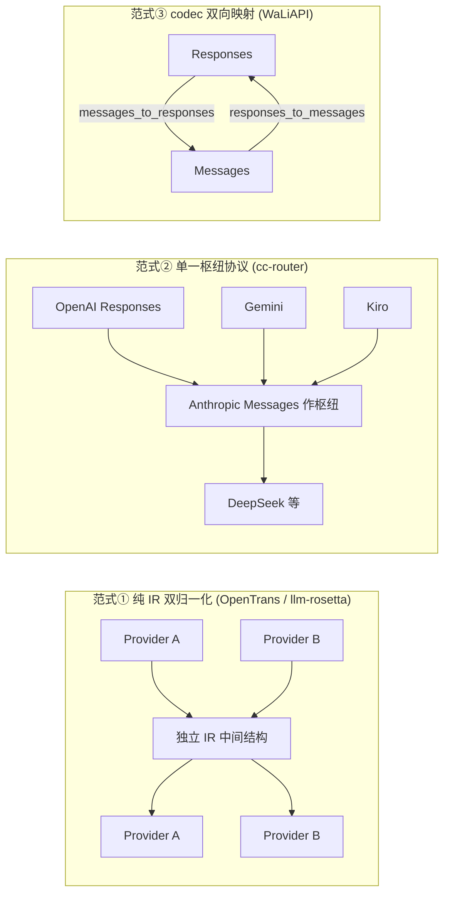
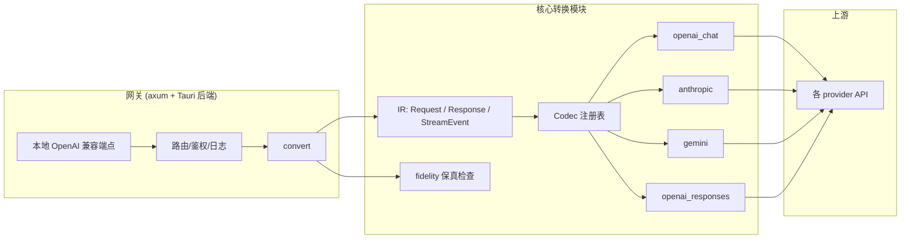

# LLM 协议转换分析报告

> **主题**：围绕「协议转换」这一核心，深度分析四个开源项目 —— OpenTrans、LLM-Rosetta、cc-router、WaLiAPI。
> **目的**：为「Tauri v2 + Rust 后端、本地个人向多提供商聚合网关」的核心模块——协议转换器——提炼各家之长、规避各家之短，给出属于自己的框架设计。
> **可追溯性**：所有关键设计均以「文件路径 + 行号 + 代码片段」标注，可回源码核对。

---

## 1. 背景与项目概览

我们计划构建一个 **Tauri v2 + Rust 后端** 的本地化个人向多提供商聚合网关。最核心的模块就是**协议转换器**：把不同 LLM 提供商的 API 格式（OpenAI Chat / OpenAI Responses / Anthropic Messages / Google Gemini）在请求、响应、流式事件三个维度上互相转换。

在动手前，我们调研了四个成熟的同类项目。它们语言各异、形态各异，但都解决同一核心问题——**跨提供商 LLM 协议转换**。

| 项目              | 语言     | 形态               | 行数(Rust/主代码) | 架构范式       |
| --------------- | ------ | ---------------- | ------------ | ---------- |
| **OpenTrans**   | Go     | 轻量 SDK + Gin 中间件 | —            | 独立 IR 双归一化 |
| **llm-rosetta** | Python | 库 + 网关           | —            | 独立 IR 双归一化 |
| **cc-router**   | Rust   | 桌面网关(Tauri 2)    | ~35k         | 单一枢纽协议     |
| **WaLiAPI**     | Rust   | 桌面网关(Tauri 2)    | ~73k         | codec 双向映射 |

**核心判断（先说结论）**：llm-rosetta 的创新点确实最突出，但它的创新主要不在「协议转换本体」，而在**转换正确性的保障机制**（fidelity 保真、passthrough 透传、声明式 shim）——而这恰恰是自己手写转换器时最值钱的部分。

---

## 2. 四种架构范式（本质区别）

表面都是"协议转换"，内核其实是三类完全不同的设计取舍：



| 范式 | 代表 | 中心抽象 | 新增 Provider 成本 | 主要缺点 |
|---|---|---|---|---|
| ① 独立 IR | OpenTrans / llm-rosetta | 一套 canonical 结构 | 写 2 个 adapter | IR 必须能表达所有概念 |
| ② 单一枢纽 | cc-router | 选 Anthropic Messages 当枢纽 | 写 1 个 adapter | 被枢纽协议表达能力绑架 |
| ③ codec 双向 | WaLiAPI | 显式双向转换矩阵 | 写 N×N | 协议多时组合爆炸 |

> **关键洞察**：cc-router 选「Anthropic Messages 当枢纽」是聪明的偷懒——Anthropic Messages 已经能表达系统/多模态/工具/流式几乎所有概念，所以**不需要设计独立 IR**，省下一大块工作量。代价是：一旦某个上游表达了 Anthropic 表达不了的特性，转换就会卡住。这也是它 README 敢写「请求体几乎完全透传」的原因——枢纽协议覆盖率高，所以真正要改的地方少。

---

## 3. 逐项目深入分析（聚焦协议转换）

### 3.1 OpenTrans —— Go 轻量 SDK，独立 IR 双归一化

**架构**：提供一套 canonical 中间结构，所有 provider 先归一化成它，再转成目标协议。

**核心 canonical 结构**（`pkg/opentrans/internal/providers/canonical/request.go:5`）：

```go
type Request struct {                          // :5
	Model       string         `json:"model"`
	Messages    []Message      `json:"messages"`
	Temperature *float64       `json:"temperature,omitempty"`
	TopP        *float64       `json:"top_p,omitempty"`
	MaxTokens   *int           `json:"max_tokens,omitempty"`
	Stream      bool           `json:"stream,omitempty"`
	Tools       []Tool         `json:"tools,omitempty"`
	Metadata    map[string]any `json:"metadata,omitempty"`
	Extra       map[string]any `json:"extra,omitempty"`   // 兜底字段
}
```

- `canonical/request.go:17` `Message`、`:23` `ContentPart`、`:35` `Tool` —— 用**单一 `ContentPart`** 统一多模态内容。
- `canonical/response.go:3` `Response`、`:20` `StreamEvent`、`:33-36` 流式事件常量（`response_start/content_delta/response_stop/usage`）。

**转换入口双归一化**（`pkg/opentrans/converter.go:10/18/29`）：

```go
func NormalizeRequest(protocol Protocol, body []byte) (*Request, error)   // :10  协议A → IR
func MarshalRequest(req *Request, protocol Protocol) ([]byte, error)      // :18  IR → 协议B
func ConvertRequestBody(body []byte, source, target Protocol) ([]byte, error) // :29  组合
```

**亮点①：fast-path 直转优化**（`pkg/opentrans/internal/providers/api.go:81`）：

```go
func convertRequestBodyFast(body []byte, source, target Protocol) ([]byte, bool, error) {
	switch {
	case source == ProtocolOpenAI && target == ProtocolClaude:
		out, err := convertOpenAIRequestBodyToClaude(body)   // :91 热点路径直转
		return out, true, err
	default:
		return nil, false, nil   // 其他组合走通用 IR 路径兜底
	}
}
```
`ConvertRequestBody`（`:46`）先尝试直转，直转失败/不存在再走 Normalize+Marshal。**热点路径少一跳、通用路径做兜底**。

**亮点②：`json.RawMessage` 保真传参**（`canonical/request.go:29-31`）：工具 `parameters/arguments/result` 用 `RawMessage`，只强类型解析自己关心的字段，其余原样透传，**避免整包二次 Marshal 丢字段**。

**亮点③：灵活 JSON 形状解析**（`openai/openai.go:80`）：OpenAI 的 `content` 字段可能是 `null` / `"字符串"` / `[数组]`，用自定义 `UnmarshalJSON` 一次解析出三种状态，避免反复探测。

**亮点④：SSE 分片边界处理**（`pkg/opentrans/ginx/middleware.go`）：

```go
func (w *sseStreamWriter) flushPending(final bool) error {          // :226
	processEnd := findLastCompleteSSEFrameEnd(w.pending.Bytes())    // 只处理"拼完整"的帧
	if processEnd < 0 { return nil }
	chunk := w.pending.Next(processEnd)                             // 半截的留在 pending
	...
}
func findLastCompleteSSEFrameEnd(data []byte) int { ... }           // :354
```
`pending` 缓冲积累字节，只把拼完整的一帧拿去转换，**避免在分片中间截断导致 JSON 解析失败**。

**短板**：字段映射是**白名单式**，只覆盖 `temperature/top_p/max_tokens` 等基础参数；新字段要手动补进 canonical + 所有 adapter。无保真校验。

---

### 3.2 llm-rosetta —— Python 库 + 网关，创新最突出

**架构**：轴辐式（hub-and-spoke）IR。但真正值钱的是它围绕「正确性」设计的四个机制。

**亮点①：fidelity 保真检查器（最具原创性）**（`src/llm_rosetta/fidelity.py`）：

```python
FidelityMode = Literal["critical", "full"]          # :22
_COMMON_REQUEST_PATHS: list[str] = [                # :30
    "model", "stream",
]
_CRITICAL_REQUEST_BY_FORMAT: dict[str, list[str]] = {  # :41 每格式的"致命字段"
    "openai_chat": [
        "max_tokens", "tools.*.type", "tool_choice",
        "messages.*.role", "messages.*.tool_calls.*.type",
    ],
    "anthropic": ["max_tokens", "system", "messages.*.role", "tools.*.name"],
    ...
}

class FidelityChecker:                              # :360
    def compare_request(self, original, roundtripped) -> list[FidelityDiff]:  # :381
        if self.mode == "critical":
            paths = _get_critical_paths(self.format_name, _COMMON_REQUEST_PATHS, ...)
            return _compare_critical(original, roundtripped, paths)
        return _compare_full(original, roundtripped)   # full: 整包递归 diff
```
**思路**：原请求 → IR → 转回来，对比差异。`critical` 只查会引发故障的关键字段（~0.01ms），`full` 整包对比。每次改 adapter 自动回归"哪里丢了字段"——补上了 OpenTrans 白名单映射的盲区。

**亮点②：passthrough 不透明透传**（`src/llm_rosetta/types/ir/passthrough.py:14`）：

```python
class ProviderPassthroughEvent(TypedDict):
    type: Required[Literal["provider_passthrough"]]
    provider: Required[str]
    payload: Required[dict[str, Any]]     # 原样塞进去，不解析
```
IR 表达不了 / 转换器不认识的特殊字段，**原样透传不丢弃**。转出时通过 `_PASSTHROUGH_RESTORE_KEY` 恢复（`converters/base/converter.py` 中 `_restore_response_passthrough_items`，见 `response_to_provider` :166 附近的调用）。

**亮点③：声明式 shim 层**（`src/llm_rosetta/shims/providers/deepseek/provider.yaml`）：

```yaml
name: deepseek
base: openai_chat            # 继承 base，多数 provider 是 OpenAI 兼容
default_base_url: https://api.deepseek.com
reasoning:
  effort_field: reasoning_effort    # 只需声明字段映射差异
```

```python
# src/llm_rosetta/shims/providers/deepseek/transforms.py
post_ir_transforms = (strip_fields("n", "logit_bias", "seed"),)   # 上游不支持的字段剥掉
ir_transforms = (hoist_late_system_messages(),)                   # 把迟到的 system 消息提升
```
加新 provider 从「写 adapter」降级为「写配置 + 声明 transforms」。

**亮点④：自动检测 provider**（`src/llm_rosetta/auto_detect.py`）：

```python
ProviderType = Literal["openai_chat", "openai_responses", "open_responses", "anthropic", "google"]  # :10

def _is_anthropic_messages(body):    # :60  OpenAI Chat 和 Anthropic 都用 messages，靠内容块区分
    if "system" in body and isinstance(body["system"], (str, list)): return True
    if "anthropic_version" in body or "max_tokens_to_sample" in body: return True
    ...
```
不靠调用方指定格式，从 body 结构用启发式规则推断格式。

**亮点⑤：细粒度 IR 类型系统**（`src/llm_rosetta/types/ir/`）：
- 按**角色**分：`messages.py:55` `BaseMessage`、`:70` `SystemMessage`、`:87` `UserMessage`、`:104` `AssistantMessage`
- 按**内容**分：`parts.py:21` `TextPart`、`:41` `ImagePart`、`:65` `FilePart`、`:92` `ToolCallPart`、`:135` `ToolResultPart`

**亮点⑥：模板方法 + 组合式 ops**（`converters/base/converter.py:26`）：

```python
class BaseConverter(ABC):
    content_ops_class: type | None = None    # :45  子类指定 ops 类，按功能域组织
    tool_ops_class: type | None = None
    message_ops_class: type | None = None
    config_ops_class: type | None = None
    _IR_TO_P_DISPATCH: dict[str, str] = {    # :81  流式事件 → handler 映射
        "stream_start": "_handle_ir_stream_start_to_p",
        "text_delta": "_handle_ir_text_delta_to_p",
        "tool_call_delta": "_handle_ir_tool_call_delta_to_p",
        "finish": "_handle_ir_finish_to_p",
        ...
    }
    def request_to_provider(self, ir_request, ...):   # :122 模板方法
    def request_from_provider(self, provider_request, ...):  # :138 模板方法，带 validate
```
按功能域（content/tool/message/config）拆成独立 ops 类，组合进具体 converter，高层接口保持简洁。

**短板**：Python 动态类型 + 运行时 dispatch；依赖 `typing_extensions`；性能非优势。

---

### 3.3 cc-router —— Rust 桌面网关，单一枢纽协议

**架构**：选 **Anthropic Messages 当枢纽协议**，不做独立 IR。所有转换都是 `Anthropic Messages ↔ X`（`src-tauri/src/proxy/transform/mod.rs:26-34` 的模块注释点明了每种转换的方向）：

```rust
// proxy/transform/mod.rs (模块头部注释)
//! 协议翻译模块. 各子模块仅供特定 `auth_type` 订阅使用, 不影响 cc-router 默认的
//! Anthropic 透传管线.
pub mod responses_common;      // :26 OpenAI Responses 翻译共享 helper
pub mod responses_inbound;     // :27 反向: OpenAI Responses → Anthropic Messages
pub mod openai_responses;      // :28 Anthropic ↔ OpenAI Responses (ChatGPT 反代)
pub mod openai;                // :29 Anthropic ↔ OpenAI 官方 /v1/responses
pub mod aws_event_stream;      // :30 AWS Event Stream 二进制流解码器
pub mod kiro_codewhisperer;    // :31 Anthropic ↔ AWS CodeWhisperer (Kiro IDE)
pub mod gemini;                // :32 Anthropic ↔ Google Gemini generateContent
pub mod gemini_interactions;   // :33 Anthropic ↔ Google Gemini Interactions
pub mod openai_chat_completions; // :34 Anthropic ↔ OpenAI Chat Completions
```

**对外端点**（`proxy/server.rs:93-96`）：

```rust
.route("/v1/messages", post(handler::messages))      // :93 Anthropic Messages 端点
.route("/v1/responses", post(handler::responses))    // :94 OpenAI Responses 端点
.route("/v1/models", axum::routing::get(handler::models))  // :95
```

**亮点①：反向入口翻译**（`proxy/handler.rs:122-126`）——对外暴露 OpenAI Responses，内部翻译成 Anthropic Messages 走现有 pipeline，响应再翻译回 OpenAI Responses：

```rust
// proxy/handler.rs:122
/// 入口翻译模式: 接收外部 agent 的 OpenAI Responses 请求, 内部翻译成 Anthropic Messages
/// 走现有 pipeline, 再把响应翻译回 OpenAI Responses 给客户端。pipeline 零改动, 所有
/// 上游 provider 路径 (9 家 Anthropic 透传 + codex/openai/gemini/kiro) 全部复用。
pub async fn responses(...) { ... }   // :126
```
**关键点**：`handler.rs:161` `request_to_anthropic(&parsed)` 先把请求翻成 Anthropic，走统一 pipeline 后，`:250` `translate_sse_to_responses` 把 Anthropic SSE 流再翻回 OpenAI Responses SSE 流。

**亮点②：SSE 流式翻译**（`proxy/sse.rs:43` `stream_response` + `handler.rs:250` 的 `AnthropicToResponsesSseConverter`），用 mpsc + spawn 的流式管道逐帧翻译。

**亮点③：虚拟模型调度**（`virtual_model/scheduler.rs:25` `build_candidate_order`、`:39` Sticky 钉住 + 轮询兜底）——这才是你印象里"轮询"的部分：它负责**多个订阅额度之间的自动切换**，和协议转换是两层事。

**短板**：绑定 Anthropic Messages 能力上限；对外主要就两个端点；转换深度浅（以透传为主），不适合做深度字段重映射的场景。

---

### 3.4 WaLiAPI —— Rust 桌面网关，codec 双向映射

**架构**：不引入统一 IR，而是**显式的方向化 codec 矩阵**（downstream × upstream），请求走 encode，响应走 decoder。模块组织（`protocol/codec/mod.rs:19-31`）：

```rust
pub mod chat;              // :19 统一 Chat 编解码
pub mod direction;         // :20 方向枚举
pub mod directions;        // :21 显式双向方向转换
pub mod identity;          // :23 同协议恒等转换
pub mod messages;          // :24 Claude Messages codec
pub mod ports;             // :25 解码器端口
pub mod registry;          // :26 编解码器注册表
pub mod responses_codec;   // :29 OpenAI Responses codec
pub mod sse;               // :30 SSE 编解码
pub use ports::{DecodedResponse, NonStreamDecoder, StreamDecoder};  // :46
pub use registry::CodecRegistry;                                     // :47
pub use report::{ConversionContext, ConversionReport, Usage};        // :49
pub use types::{CodecId, PreparedCodec, PreparedConversion, Protocol}; // :51
```

**亮点①：解码器端口抽象**（`protocol/codec/ports.rs`）：

```rust
pub struct DecodedResponse {              // :13  响应体 + 用量一起返回，免二次解析
    pub body: Value,
    pub usage: Option<Usage>,
}
pub trait NonStreamDecoder: Send + Sync { // :29
    fn decode(&self, body: &Value) -> Result<DecodedResponse, DecodeError>;
}
pub trait StreamDecoder: Send + Sync {    // :34  有状态 SSE 解码器，feed/finish
    fn feed(&mut self, bytes: &[u8]) -> Result<Vec<String>, DecodeError>;
    fn finish(&mut self) -> Result<Vec<String>, DecodeError>;
    fn usage(&self) -> Option<Usage>;
}
```
把「响应解码」抽象成端口，且 `DecodedResponse` 顺带把 **usage** 一并返回——避免下游重复解析原始响应。

**亮点②：方向化注册表**（`protocol/codec/registry.rs`）：
`:172` `struct CodecRegistry`，`:199` `prepare_pair(downstream, upstream, ...)` 根据 `(downstream, upstream)` 查表取策略；`:218-246` 提供 `chat_to_messages / messages_to_responses / responses_to_messages ...` 等具名入口。请求 encode + 响应 decoder 配对，`FnDirection` 结构体把一个方向的一次转换所需的三样东西打包（`:28` encode 函数、non_stream/streaming decoder 工厂）。

**亮点③：显式方向转换目录**（`protocol/codec/directions/mod.rs:3-4`）：
```rust
pub mod messages_to_responses;
pub mod responses_to_messages;
```
把双向转换拆成独立模块，每个都有 decode/encode/stream。这是 WaLiAPI 区别于其他三者的**最独特之处**：转换方向是第一等公民。

**亮点④：`ConversionContext` / `ConversionReport`**（`report.rs`，经 `mod.rs:49` 导出）——每次转换带 context（request_id/model/stream + normalized 字段列表），可追踪"哪些字段被规范化了"，这是可观测性的基础。

**亮点⑤：拒绝机制**（`protocol/codec/request.rs:16 reject`、`:31 finish`）：遇到无法表达的特性，明确返回 `UnsupportedFeatures` 而不是静默丢弃。

**短板**：73k 行全功能（RAG/MCP/wiki/auth/安全）远超个人需求，over-engineered；codec 矩阵在协议多时是 N×N 组合，靠 `CodecRegistry` 管理但代码量巨大。

---

## 4. 长处 / 缺陷矩阵

| 能力维度 | OpenTrans | llm-rosetta | cc-router | WaLiAPI |
|---|---|---|---|---|
| 语言匹配我们(Rust) | ✗ | ✗ | **✓** | **✓** |
| 转换深度 | 基础 | **深**(embedding/rerank) | 浅(透传) | **深** |
| 扩展新 provider 成本 | 写代码 | **写配置(shim)** | 写 adapter | 写 codec |
| 保真保障 | 无 | **★fidelity+passthrough** | 透传天然保真 | codec+report |
| 流式处理 | **★分片边界** | 一般 | **★SSE 流式翻译** | **★feed/finish decoder** |
| 错误处理 | 普通 | 普通 | 普通 | **★UnsupportedFeatures 显式拒绝** |
| 可观测性 | 无 | conversion warnings | 有日志 | **★ConversionReport** |
| 复杂度 | 低 | 中 | 中 | 高 |

**各家最值得抄的点**：
- OpenTrans → SSE 分片边界处理、`json.RawMessage` 保真、fast-path 优化
- llm-rosetta → fidelity 保真检查、passthrough 透传、声明式 shim、自动检测
- cc-router → 单一枢纽协议降低复杂度、SSE 流式翻译、反向入口
- WaLiAPI → 方向化 codec 注册表、decoder 端口抽象、ConversionReport、显式拒绝

**各家最该避免的缺陷**：
- OpenTrans → 白名单字段映射，丢字段无感；无保真校验
- llm-rosetta → Python 动态类型 + 运行时 dispatch；性能弱
- cc-router → 绑定单一枢纽协议表达能力；转换深度浅
- WaLiAPI → 过度设计，N×N 矩阵代码量爆炸；个人项目驾驭成本高

---

## 5. 我们的协议转换模块框架设计

综合四家长处、规避各家缺陷，针对「**Tauri v2 + Rust 后端、本地个人向网关**」这一场景，给出我们的设计。

**先明确定位**：
- 本地个人向 → **性能不是首要**，正确性 + 可维护性 + 易扩展才是第一优先级。
- 核心转换器自己写 → 要把原理吃透（我们的长期目标是 Agent 工程师，底层能力比调现成 crate 值钱）。
- Rust 是我们技术栈 → 用 enum 强类型、trait 抽象、无 runtime dispatch。

### 5.1 总体架构



### 5.2 核心模块划分（Rust crate）

```text
llm-gateway/
├── src/
│   ├── ir/                    # 标准中间结构（借鉴 llm-rosetta 细粒度 + OpenTrans canonical）
│   │   ├── mod.rs
│   │   ├── request.rs         # IRRequest
│   │   ├── response.rs        # IRResponse
│   │   ├── stream.rs          # IRStreamEvent (enum)
│   │   ├── content.rs         # ContentPart (enum)
│   │   └── passthrough.rs     # 不透明透传（抄 llm-rosetta passthrough）
│   ├── codec/                 # 协议编解码（借鉴 WaLiAPI codec 组织 + cc-router 枢纽）
│   │   ├── mod.rs             # Codec trait
│   │   ├── registry.rs        # CodecRegistry（抄 WaLiAPI registry）
│   │   ├── ports.rs           # Decoder 端口（抄 WaLiAPI ports）
│   │   ├── report.rs          # ConversionReport（抄 WaLiAPI report）
│   │   ├── sse.rs             # SSE 分片处理（抄 OpenTrans flushPending）
│   │   ├── openai_chat/
│   │   ├── openai_responses/
│   │   ├── anthropic/
│   │   └── gemini/
│   ├── fidelity.rs            # round-trip 保真检查（抄 llm-rosetta fidelity）
│   ├── convert.rs             # 转换入口 + fast-path（抄 OpenTrans）
│   └── auto_detect.rs         # 自动识别格式（抄 llm-rosetta auto_detect）
```

### 5.3 关键设计决策（每条都源自某个项目的印证）

**决策①：用 Rust enum 表达 IR 内容，不用 string 分派**（改良 llm-rosetta 的 TypedDict / OpenTrans 的 string type）：

```rust
// src/ir/content.rs
enum ContentPart {
    Text { text: String },
    Image { url: String, detail: Option<ImageDetail> },
    File { url: String, mime: Option<String> },
    ToolCall { id: String, name: String, arguments: serde_json::Value },  // 保真
    ToolResult { id: String, name: String, content: serde_json::Value },  // 保真
    Passthrough(ProviderPassthrough),   // 抄 llm-rosetta:14
}

enum Role { System, User, Assistant, Tool }
```
> **为什么**：Rust enum 让"不认识的内容类型"在编译期就暴露，而 string + match 是运行时才知道。`arguments`/`content` 用 `serde_json::Value` 保真（同 OpenTrans `RawMessage` 的动机，`canonical/request.go:29`）。

**决策②：StreamEvent 用 enum 表达流式事件**（改良 llm-rosetta `_IR_TO_P_DISPATCH` 字符串映射，`converter.py:81`）：

```rust
// src/ir/stream.rs
enum IRStreamEvent {
    StreamStart { id: String },
    TextDelta { text: String },
    ReasoningDelta { text: String },
    ToolCallStart { id: String, name: String },
    ToolCallDelta { args_fragment: String },
    Finish { reason: StopReason },
    Usage { input_tokens: u64, output_tokens: u64 },
    Passthrough(ProviderPassthrough),   // 不认识的事件不丢
}
```
> **为什么**：模式匹配是穷尽的，加新事件类型编译器会提示所有需要处理的地方，杜绝漏转换。

**决策③：Codec trait 统一双向接口**（借鉴 WaLiAPI `CodecDirection` 的 encode+decoder 配对，`registry.rs:28`）：

```rust
// src/codec/mod.rs
trait Codec: Send + Sync {
    const TAG: &'static str;                      // "openai_chat"
    fn request_to_ir(&self, raw: &Value) -> Result<IRRequest, CodecError>;
    fn request_from_ir(&self, ir: &IRRequest) -> Result<Value, CodecError>;
    fn stream_to_ir(&self, raw: &Value) -> Result<IRStreamEvent, CodecError>;
    fn stream_from_ir(&self, ev: &IRStreamEvent) -> Result<Value, CodecError>;
}
```

**决策④：registry 方向化查找 + identity 恒等优化**（借鉴 WaLiAPI `CodecRegistry::prepare_pair`，`registry.rs:199`；恒等借鉴 `identity.rs:13`）：

```rust
// src/codec/registry.rs
struct CodecRegistry {
    codecs: HashMap<ProviderId, Box<dyn Codec>>,
}
impl CodecRegistry {
    fn convert_request(&self, src: ProviderId, dst: ProviderId, raw: &Value) -> Result<Value, CodecError> {
        if src == dst { return Ok(raw.clone()); }   // 同协议恒等，直接透传
        let ir = self.codecs[&src].request_to_ir(raw)?;
        self.codecs[&dst].request_from_ir(&ir)
    }
}
```

**决策⑤：SSE 分片边界处理**（直接照抄 OpenTrans 的 pending buffer 思路，`ginx/middleware.go:226`）：

```rust
// src/codec/sse.rs
struct SseFrameAccumulator {
    pending: Vec<u8>,
}
impl SseFrameAccumulator {
    fn push(&mut self, bytes: &[u8]) -> Vec<IRStreamEvent> {
        self.pending.extend_from_slice(bytes);
        let process_end = find_last_complete_frame_end(&self.pending);  // 只处理完整帧
        let chunk = self.pending.split_off(process_end);
        chunk.iter().filter_map(|f| parse_event(f).ok()).collect()
    }
}
```
> **为什么**：HTTP 分块可能在任何字节处截断，只在"拼完整的一帧"上解析，半截留在 buffer。

**决策⑥：fidelity 保真检查器**（直接抄 llm-rosetta，`fidelity.py:360`，我们场景下是最值钱的）：

```rust
// src/fidelity.rs
struct FidelityChecker {
    mode: FidelityMode,   // Critical | Full
}
impl FidelityChecker {
    /// 原请求 → IR → 转回，对比关键字段是否丢失
    fn check_request(&self, original: &Value, roundtripped: &Value) -> Vec<FidelityDiff>;
}
```
配合**测试**：每个 adapter 配一组 round-trip 测试，`Critical` 模式只查 `model / role / tool_call_id / finish_reason` 等致命字段（参照 llm-rosetta `_CRITICAL_REQUEST_BY_FORMAT`，`fidelity.py:41`），改代码自动回归。

**决策⑦：passthrough + 显式拒绝**（抄 llm-rosetta `passthrough.py` + WaLiAPI `request.rs:16 reject`）：
- IR 表达不了的字段进 `Passthrough` 原样透传，不丢。
- 真无法转换的**明确返回 `UnsupportedFeatures` 错误**，绝不静默丢弃（`WaLiAPI protocol/codec/request.rs:31 finish`）。

**决策⑧：声明式 provider 配置**（借鉴 llm-rosetta shim 思路，`shims/providers/deepseek/provider.yaml`）：
```yaml
# 本地配置: providers/xxx.yaml
name: deepseek
base: openai_chat          # 多数 provider 是 OpenAI 兼容
strip_fields: [n, logit_bias, seed]   # 上游不支持的字段
```
加新 provider = 写一份 YAML + 只在有特殊逻辑时才写 Rust adapter。**默认走 base，特例覆盖**。

**决策⑨：auto-detect 自动识别请求格式**（借鉴 llm-rosetta `auto_detect.py`）——网关统一端点收到请求时，根据 body 结构启发式判断是哪种格式再派发给对应 codec，免去调用方手动指定。

**决策⑩：fast-path 直转**（借鉴 OpenTrans `api.go:81`）——对高频组合（如仅暴露 OpenAI 端点 + OpenAI 上游）跳过 IR，直接透传，减少一次编解码。

### 5.4 我们规避的缺陷

| 原项目缺陷 | 我们的对策 |
|---|---|
| OpenTrans 白名单丢字段无感 | fidelity 保真检查 + passthrough 透传 |
| llm-rosetta 动态类型/性能弱 | Rust enum + trait，零 runtime dispatch |
| cc-router 绑定单一枢纽表达能力 | 独立 IR（不被某协议绑架），保留透传能力 |
| WaLiAPI N×N 矩阵爆炸 / 过度设计 | IR 双归一化（N 个 adapter 而非 N×N）+ 按需裁剪 |

### 5.5 场景适配结论

- **对外暴露几个端点**？若只暴露**一个**（如 OpenAI Chat），可参考 cc-router 的「单一枢纽」思路，用 IR 但让 OpenAI Chat 承担枢纽角色，降低复杂度。
- **核心建议**：以 llm-rosetta 的**正确性机制**（fidelity + passthrough + 声明式）为第一优先级，以 WaLiAPI 的 **codec 组织**（registry + ports + report）为骨架，以 OpenTrans 的 **SSE 分片处理 + 保真透传**为流式方案，以 cc-router 的**单一枢纽降低复杂度**为取舍参考。

---

## 6. 结论

这四个项目覆盖了「协议转换」问题的三种本质解法，各有不可替代的参考价值：

1. **llm-rosetta 决定"转换得对不对"** —— fidelity 保真、passthrough 透传、声明式 shim，是正确性的保障，最值得抄。
2. **WaLiAPI 决定"代码怎么组织"** —— direction codec、registry、ports、report，是 Rust 技术栈里最贴近我们的成熟骨架。
3. **OpenTrans 决定"流式怎么处理"** —— SSE 分片边界 + 保真透传，是流式转换最硬的坑的解法。
4. **cc-router 决定"要不要简化成单枢纽"** —— 单一枢纽协议大幅降低复杂度，是取舍的参考。

**最终建议**：动手，但别从零写 73k 行。以 WaLiAPI 的 `codec` 组织为骨架、llm-rosetta 的正确性机制为灵魂、OpenTrans 的 SSE 处理为细节、cc-router 的枢纽思路为取舍，实现一个**精简但能自证正确**的 Rust 协议转换核心。

> 后续行动项：
> - [ ] 拉取 cc-router / WaLiAPI 源码作第三、四份对照（已 clone 在 `D:\Projects\`）
> - [ ] 以 5.2 的目录骨架初始化 Rust crate
> - [ ] 先实现 openai_chat + anthropic 一对 codec + fidelity round-trip 测试，跑通最小闭环
> - [ ] 再逐步扩展 responses / gemini

---

## 7. 附录：三大协议完整图景与 IR 映射

> 本附录补上此前缺失的一环——**协议本体到底长什么样**。IR 设计的地基正在于此：IR 必须能完整表达三协议的概念，否则必然漏字段。
>
> **资料来源**：`CLASP` 项目按同一格式整理的官方 API reference（Top-Level Fields + Content Block Types + Streaming Format），本地缓存于 `D:\Projects\_proto_refs\`（`openai_chat_completions.md` / `openai_responses.md` / `anthropic_messages.md`）。官方原文：
> - OpenAI Chat Completions：`developers.openai.com/api/reference/resources/chat`
> - OpenAI Responses：`developers.openai.com/api/reference/resources/responses`
> - Anthropic Messages：`docs.anthropic.com/en/api/messages`

### 7.1 OpenAI Chat Completions（`/v1/chat/completions`）

**请求顶层字段**（`openai_chat_completions.md`）：`model`(必) / `messages`(必) / `max_tokens` / `max_completion_tokens` / `temperature` / `top_p` / `stream` / `tools` / `tool_choice` / `response_format` / `reasoning_effort`。

**消息对象**——`role` 有四种（`system|user|assistant|tool`），`content` 是字符串或 ContentPart 数组：

```json
{ "role": "system" | "user" | "assistant" | "tool",
  "content": "string" | ContentPart[],
  "name": "optional", "tool_calls": [...], "tool_call_id": "..." }
```

**Content Part**：`text`（`{type,text}`） / `image_url`（`{type,image_url:{url,detail}}`，支持 base64 data URL）。

**系统消息**：在 `messages[0].role:"system"` 里（不是独立字段）。

**工具定义**（外带 `function` 包装 + `strict`）：
```json
{ "type": "function",
  "function": { "name": "get_weather", "description": "...",
                "parameters": { "type": "object", "properties": {...}, "required": [...] },
                "strict": false } }
```

**tool_choice**：`"auto"` / `"required"` / `"none"` / `{"type":"function","function":{"name":"X"}}`。

**响应**（非流式）：`{id:"chatcmpl-*", object:"chat.completion", choices:[{message:{role,content,refusal}, finish_reason}], usage:{prompt_tokens,completion_tokens,total_tokens}}`。
工具调用响应：assistant message 里带 `tool_calls:[{id:"call_*", type:"function", function:{name, arguments:"{\"location\":...}"}}]`，`finish_reason:"tool_calls"`。

**工具结果**：`{role:"tool", tool_call_id:"call_*", content:"72°F"}`。

**流式**：SSE `data:` 前缀 JSON chunk；首块 delta 带 `role:"assistant"`，文本走 `delta.content`，工具走 `delta.tool_calls`（`arguments` 分片累积），最后 `finish_reason` + `data: [DONE]` 结尾。

**finish_reason**：`stop`(↔Anthropic `end_turn`) / `length`(↔`max_tokens`) / `tool_calls`(↔`tool_use`) / `content_filter`。

### 7.2 OpenAI Responses（`/v1/responses`）

**请求顶层字段**：`model`(必) / `input`(必) / `instructions` / `max_output_tokens`(≥16) / `temperature` / `top_p` / `stream` / `tools` / `tool_choice` / `previous_response_id` / `reasoning`。

**`input` 是带类型的 item 数组**：
```json
// 消息项
{ "type": "message", "role": "user"|"assistant", "content": "string"|ContentPart[] }
// 工具调用项（assistant 侧）
{ "type": "function_call", "id": "fc_*", "call_id": "fc_*", "name": "get_weather",
  "arguments": "{\"location\":\"...\"}" }
// 工具结果项
{ "type": "function_call_output", "call_id": "fc_*", "output": "72°F" }
```

**Content Part 命名与 Chat 不同**：用户内容用 `input_text`（不是 `text`），历史 assistant 内容用 `output_text`，图片用 `input_image`。

**系统指令**：顶层 `instructions` 字段（不是 messages）。

**工具定义**：扁平结构 `{type:"function", name, description, parameters}`，可选保留 `function` 包装。

**工具 ID 前缀**：`fc_`（Chat 是 `call_`，Anthropic 是 `toolu_`）——**转换时必须改写前缀**。

**响应**：`{id:"resp_*", object:"response", output:[{type:"message",role:"assistant",content:[{type:"output_text",text}]}], usage:{input_tokens,output_tokens,total_tokens}, status:"completed"}`。工具调用是 `output` 里的 `function_call` item。
**status**：`completed / failed / cancelled / incomplete`。

**流式**（SSE 多事件，每帧 `event:` + `data:` 双行）：
```
response.created → response.output_item.added → response.content_part.added
→ response.output_text.delta → response.output_text.done → response.output_item.done → response.completed
```
**无 `[DONE]`**，客户端按 `response.completed` 结束。

**有状态**：`previous_response_id` 续接。

### 7.3 Anthropic Messages（`/v1/messages`）

**请求顶层字段**：`model`(必) / `max_tokens`(**必**) / `messages`(必) / `system` / `stream` / `temperature`(0-1) / `top_p` / `top_k` / `tools` / `tool_choice` / `thinking`。

**系统消息**：**独立顶层 `system` 字段**，且可以是 string 或带 `cache_control` 的 text block 数组：
```json
{ "system": "You are a helpful assistant." }
{ "system": [ { "type": "text", "text": "...", "cache_control": {"type": "ephemeral"} } ] }
```

**内容块类型**：`text` / `image`(`source:{type:"base64", media_type, data}`) / `tool_use`(assistant) / `tool_result`(user)：
```json
{ "type": "tool_use", "id": "toolu_*", "name": "get_weather", "input": {"location":"..."} }
{ "type": "tool_result", "tool_use_id": "toolu_*", "content": "72°F" }
```

**工具定义**：用 `input_schema`（不是 `parameters`）：`{name, description, input_schema:{...}}`。

**tool_choice**：`{"type":"auto"}` / `{"type":"any"}` / `{"type":"none"}` / `{"type":"tool","name":"X"}`。

**thinking**：`{type:"enabled", budget_tokens:10000}`。

**响应**：`{id:"msg_*", type:"message", role:"assistant", content:[{type:"text",text}], stop_reason:"end_turn", usage:{input_tokens,output_tokens}}`。
**stop_reason**：`end_turn / stop_sequence / max_tokens / tool_use`。

**流式**（SSE 事件序列）：
```
message_start → content_block_start → content_block_delta → content_block_stop
→ message_delta → message_stop
```
`content_block_delta` 的 `delta.type` 区分 `text_delta` / 工具参数增量。

---

### 7.4 三协议对照表（关键差异）

#### 请求侧

| 概念 | OpenAI Chat | OpenAI Responses | Anthropic Messages |
|---|---|---|---|
| 端点 | `/v1/chat/completions` | `/v1/responses` | `/v1/messages` |
| 系统消息 | `messages[0].role="system"` | 顶层 `instructions` | 顶层 `system`（string 或 block 数组） |
| 用户文本类型 | `text` | `input_text` | `text` |
| 工具调用位置 | messages 内 `tool_calls` | input 内 `function_call` item | content 内 `tool_use` block |
| 工具结果位置 | `role:"tool"` 消息 | `function_call_output` item | `tool_result` block |
| 工具 ID 前缀 | `call_` | `fc_` | `toolu_` |
| 工具参数字段 | `function.parameters` | 扁平 `parameters` | `input_schema` |
| 工具 strict | `strict`(外包装内) | 可选 function 包装 | 无 |
| max_tokens | 可选，双别名 | `max_output_tokens`(≥16) | **必填** |
| reasoning/thinking | `reasoning_effort`(顶层) | `reasoning.effort`(嵌套) | `thinking.budget_tokens` |
| tool_choice 语义 | auto/required/none/function | 同 Chat | auto/any/none/tool |

#### 响应侧

| 概念 | OpenAI Chat | OpenAI Responses | Anthropic Messages |
|---|---|---|---|
| 结束原因 | `finish_reason` | `status` | `stop_reason` |
| 结束值 | `stop/length/tool_calls/content_filter` | `completed/failed/cancelled/incomplete` | `end_turn/stop_sequence/max_tokens/tool_use` |
| 用量字段 | `prompt_tokens/completion_tokens/total_tokens` | `input_tokens/output_tokens/total_tokens` | `input_tokens/output_tokens` |

#### 流式侧

| 维度 | OpenAI Chat | OpenAI Responses | Anthropic Messages |
|---|---|---|---|
| 帧格式 | 单 `data:` JSON | `event:` + `data:` 双行 | `event:` + `data:` 双行 |
| 结束标志 | `data: [DONE]` | 无 `[DONE]`，靠 `response.completed` | `message_stop` |
| 事件模型 | 统一 chunk | 多事件(created/added/delta/done/completed) | 多事件(start/delta/stop) |
| 增量内容 | `delta.content` | `response.output_text.delta` | `content_block_delta`(text_delta) |
| 工具增量 | `delta.tool_calls[].arguments` 分片 | `response.output_item.done`(整段) | `content_block_delta`(input_json_delta) |

### 7.5 对 IR 设计的启示（映射到我们的框架）

这三大协议的差异，直接决定了 §5 里 IR 的设计边界。逐条对应：

**① Role 必须覆盖 4 种**（Chat 有 `tool`，Anthropic 无 tool role）
```rust
enum Role { System, User, Assistant, Tool }   // Tool 只用于 OpenAI 系
```
系统消息三处不同 → IR 里**单独拆出 system**，不要塞进 messages（否则从 Anthropic 转回 Chat 时要把 system 塞回 messages[0]，反而麻烦）。

**② ContentPart enum 的 `tool_call/tool_result` 是必须的，且要用 `serde_json::Value` 保真**：
```rust
enum ContentPart {
    Text { text: String },
    Image { url: String, detail: Option<Detail> },   // Chat 用 image_url.url / Anthropic 用 source
    ToolCall { id: String, name: String, arguments: Value },   // Chat arguments 是 string / Anthropic input 是 object
    ToolResult { id: String, name: String, content: Value },   // 三种协议都不同，保真最稳
    Passthrough(ProviderPassthrough),   // cache_control / strict / detail / refusal 等塞这里
}
```

**③ 工具 ID 前缀必须转换**：`call_` / `fc_` / `toolu_`。IR 里存**无前缀的 stem**，转出时按目标协议加前缀（正是 llm-rosetta `BaseConverter.add_response_id_prefix` / `strip_response_id_prefix` 做的事）。

**④ tool_choice 语义不是一一对应**：Chat 的 `required` 没有直接等价物（Anthropic 用 `any` 近似）；Anthropic 的 `{"type":"tool","name":X}` 与 Chat 的 `{"type":"function","function":{"name":X}}` 结构不同。→ 这是**转换难点**，IR 里需要独立表达，或进 passthrough + fidelity 校验。

**⑤ reasoning/thinking 三层映射**：`reasoning_effort` ⇄ `reasoning.effort` ⇄ `thinking.budget_tokens`。CLASP 的映射法是 `budget_tokens <4000→low, 4000-16000→medium, >16000→high`。→ IR 需有专门字段或进 passthrough。

**⑥ max_tokens 语义差异**：Chat 可选/双别名、Anthropic 必填、Responses `max_output_tokens`(≥16)。→ 从 Anthropic 转出时必须保证填满，从 Responses 转出注意最小值。

**⑦ 流式事件是三套完全不同的模型** → 这就是 §5.3 决策② 用 `IRStreamEvent` enum 的原因：
```rust
enum IRStreamEvent {
    StreamStart { id: String },          // Chat 首chunk / Responses created / Anthropic message_start
    TextDelta { text: String },          // Chat delta.content / Responses output_text.delta / Anthropic text_delta
    ToolCallStart { id, name },          // Chat tool_calls[0] / Anthropic content_block_start(tool_use)
    ToolCallDelta { args_fragment },     // Chat arguments 分片 / Anthropic input_json_delta
    Finish { reason },                   // Chat finish_reason / Responses completed / Anthropic message_delta
    Usage { input_tokens, output_tokens },
    Passthrough(ProviderPassthrough),
}
```

**⑧ 三种协议都有「响应结束/停止原因」但枚举值不同** → IR 用统一 `StopReason { Stop, Length, ToolCall, ... }`，各 codec 负责双向映射（对应 CLASP 的 finish_reason↔stop_reason 表）。

**⑨ 必须保留 `passthrough`**：`cache_control`、`strict`、`refusal`、`previous_response_id`、`status` 这类协议特有字段，IR 表达不了就原样透传——这正是 llm-rosetta passthrough 机制（§3.2）在真实协议图景下的必要性印证。

**⑩ 用 fidelity 校验上述所有映射**：每次 codec 改动，round-trip 对比 `role / tool_call_id / finish_reason / tools.*.type / max_tokens` 等致命字段（对应 llm-rosetta `_CRITICAL_REQUEST_BY_FORMAT` 的思路），确保跨协议转换不漏、不错。

> **小结**：三大协议的图景揭示了一件事——**IR 的价值不在"表达共同点"，而在"优雅地容纳不同点"**。共同的文本/图片好办，真正的功夫全在这些差异点（系统消息位置、工具 ID、tool_choice 语义、reasoning 映射、流式事件模型）上。这也再次印证了"fidelity 保真 + passthrough 透传"这两条机制对自研转换器是刚需，而不是锦上添花。
